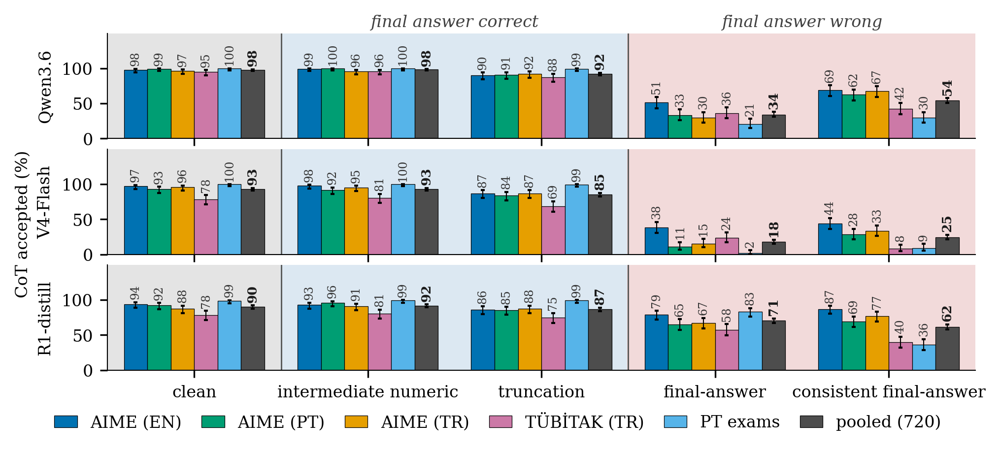
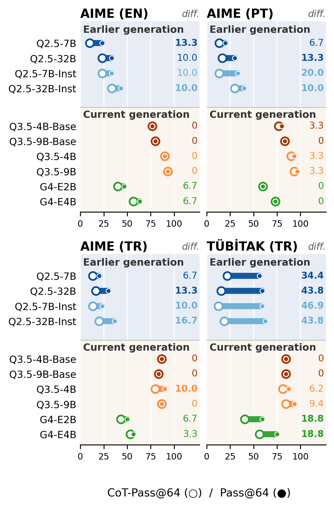
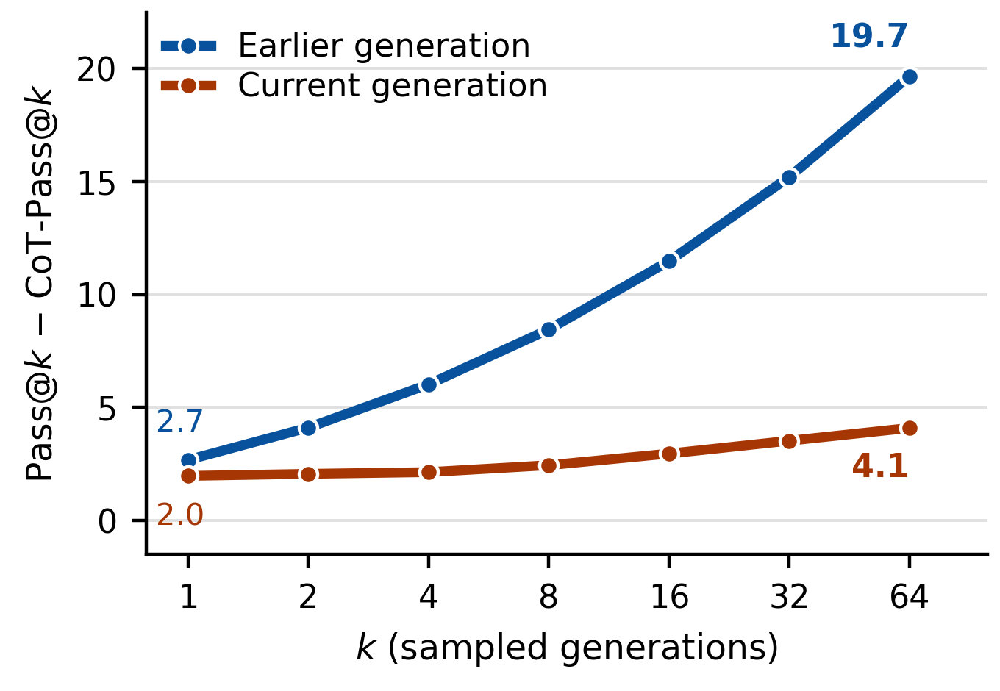
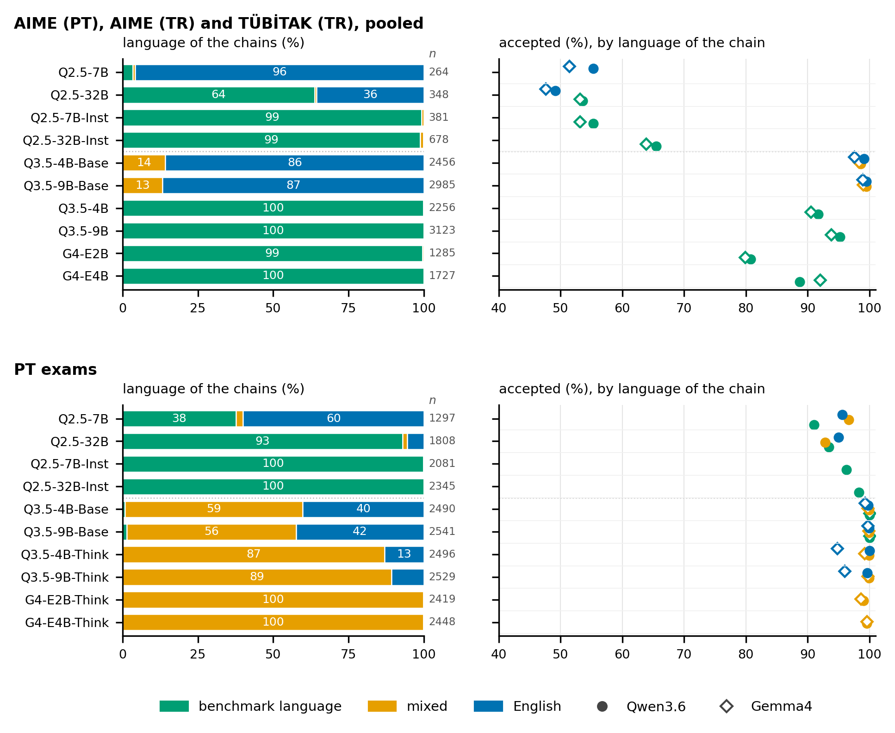

# Results

The numbers below are the paper's, regenerated from `analysis/data` by the scripts in `analysis/src` (see `analysis/README.md` for the mapping). Percent values are percentage points.

## The judges miss the injected reasoning errors

720 answer-correct thinking-mode solutions (Qwen3.5-4B and Qwen3.5-9B, 72 per solver and benchmark cell) were edited in four controlled ways and judged three times each. A variant counts as accepted when at least one verdict approves it (any), when approvals outnumber rejections (majority, the rule of the metric), or when all three approve (all). Source: `analysis/tables/tab_error_rules.tex`, `analysis/src/tab_error_rules.py`.

| Judge | Variant | any | majority | all |
|---|---|---|---|---|
| V4-Flash | Clean | 96.2 | 92.9 | 89.2 |
| V4-Flash | Intermediate numeric error | 96.1 | 93.1 | 90.1 |
| V4-Flash | Truncation error | 89.3 | 85.1 | 78.8 |
| V4-Flash | Final-answer error | 47.2 | 18.1 | 6.4 |
| V4-Flash | Consistent final-answer error | 49.0 | 24.6 | 12.4 |
| Qwen3.6 | Clean | 99.4 | 97.8 | 81.2 |
| Qwen3.6 | Intermediate numeric error | 99.2 | 98.2 | 81.0 |
| Qwen3.6 | Truncation error | 93.9 | 92.1 | 69.2 |
| Qwen3.6 | Final-answer error | 67.2 | 34.3 | 7.8 |
| Qwen3.6 | Consistent final-answer error | 75.6 | 54.2 | 27.8 |
| R1-distill | Clean | 96.9 | 90.1 | 36.4 |
| R1-distill | Intermediate numeric error | 96.0 | 91.9 | 42.2 |
| R1-distill | Truncation error | 92.1 | 86.7 | 67.4 |
| R1-distill | Final-answer error | 91.9 | 70.6 | 28.3 |
| R1-distill | Consistent final-answer error | 80.3 | 61.8 | 23.1 |

The intermediate numeric error, which breaks the chain but leaves the final answer intact, is accepted as often as the clean solution by every judge; only the two final-answer edits are rejected. R1-distill, the judge the metric specifies, still accepts 71% of the plain wrong answers.

## CoT-Pass@k collapses onto Pass@k in current solvers

Pass@64 minus CoT-Pass@64, averaged over the four 64-sample benchmarks (weighted by question count), for every judge that covers the solver. Source: `analysis/tables/tab_judge_matrix.tex`, `analysis/src/tab_judge_matrix.py`.

Earlier-generation solvers (Qwen2.5, -I = Instruct):

| Solver | Qwen3.6 | Gemma4 | V4-Flash | R1-distill |
|---|---|---|---|---|
| Q2.5-7B | 15.6 | 13.9 | 18.0 | 15.6 |
| Q2.5-32B | 20.5 | 22.1 | 23.0 | 21.3 |
| Q2.5-7B-I | 22.1 | 23.0 | 23.8 | 22.1 |
| Q2.5-32B-I | 20.5 | 20.5 | 21.3 | 21.3 |
| Average | 19.7 | 19.9 | 21.5 | 20.1 |

Current-generation solvers (Qwen3.5, -B = base; G4 = Gemma-4-it):

| Solver | Qwen3.6 | Gemma4 |
|---|---|---|
| Q3.5-4B-B | 0.8 | 1.6 |
| Q3.5-9B-B | 0.0 | 0.8 |
| Q3.5-4B | 4.9 | 6.6 |
| Q3.5-9B | 3.3 | 4.1 |
| G4-E2B | 8.2 | 8.2 |
| G4-E4B | 7.4 | 4.9 |
| Average | 4.1 | 4.4 |

Question-level bootstrap (10,000 resamples) under the anchor judge Qwen3.6 at the 16k budget: the average difference is 19.7 points [16.4, 23.0] for the earlier generation and 4.1 [2.7, 5.5] for the current one; the contrast is 15.6 [12.0, 19.3]. Source: `analysis/data/diff_bootstrap_ci.csv`, `analysis/src/bootstrap_questions.py`.

## Raising the budget moves the scores, not the difference

Doubling the generation budget changes Pass@64 by several points per cell while Pass@64 minus CoT-Pass@64 stays exactly zero in all sixteen ladder cells (`analysis/tables/tab_ladder.tex`, `analysis/src/tab_ladder.py`). The judge's own budget matters more: part of the difference under a capped judge comes from verdicts the judge never finished (`analysis/figures/fig_judge_capping.png`).

## Language of the chains

On the Turkish and Portuguese benchmarks most reasoning chains are written in the benchmark language by the earlier generation and increasingly in English or a mixture by the current one; acceptance by language class is in `analysis/tables/tab_code_switching.tex` and `analysis/figures/fig_code_switching.png` (`analysis/src/code_switching.py`, `code_switching_tables.py`).

